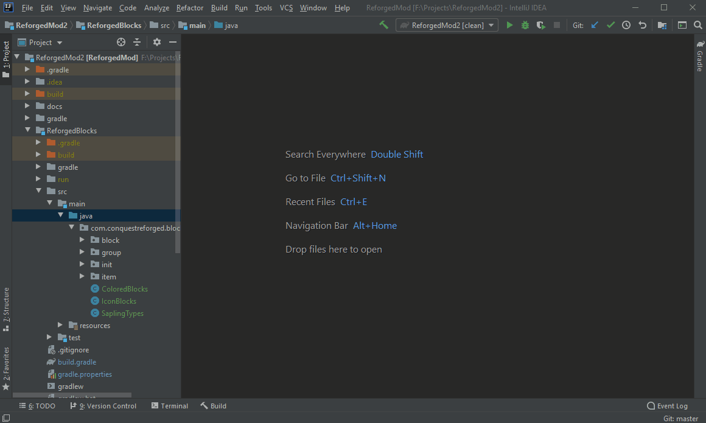

# Run Configs

You may find you need to manually add the `runClient` & `runServer` configurations.
 Follow the steps in the gif below to achieve this:
 

### Testing Modules
In this example I set up `runClient` for testing _just_ the ReforgedBlocks module.
 Code from ReforgedCore is added to the classpath because it is defined as a dependency in `module.gradle`,
 but ReforgedClient & ReforgedEntities are not compiled/loaded.

### Testing The Final Mod
A separate run config can be made for the root project in order to test the final mod (ie all modules combined).
 The steps are the same, but you select ReforgedMod for the "Gradle Project" field in the run config.